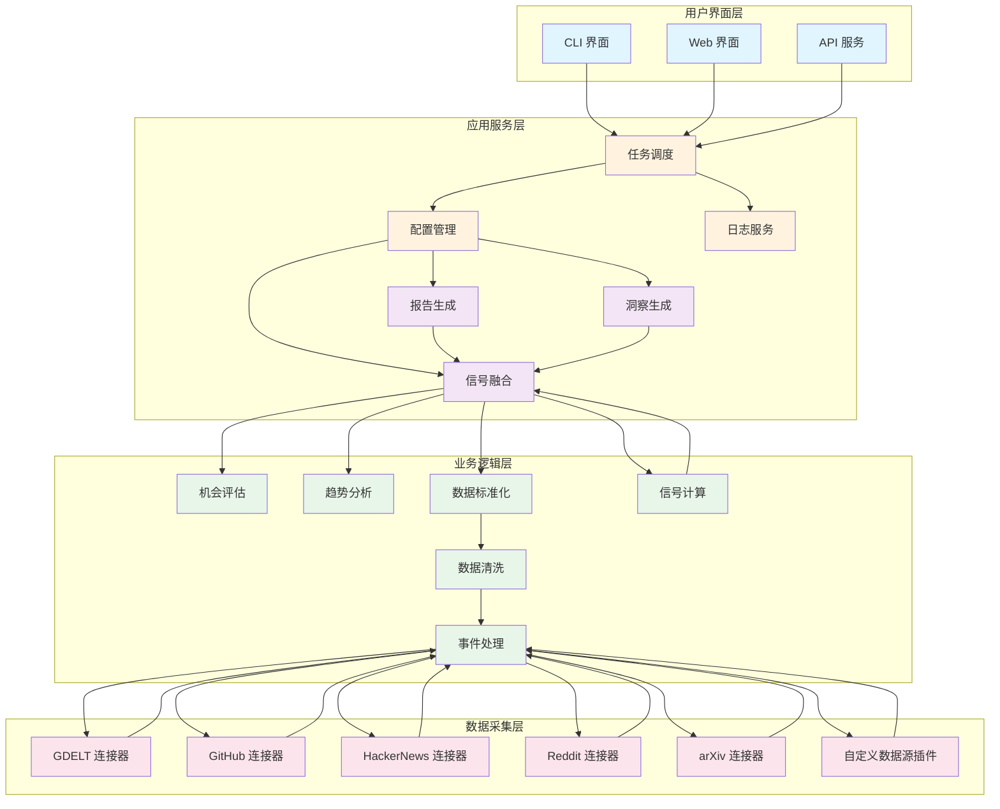
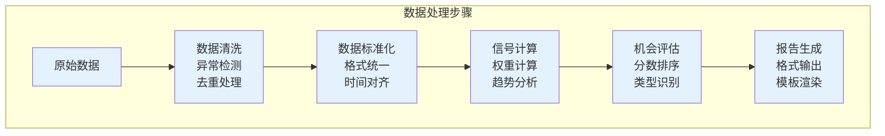
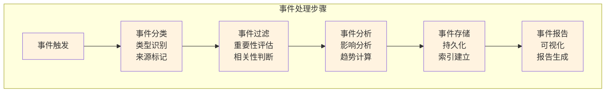

# 技术架构文档

## 概述

行业机会探测器采用模块化、可扩展的架构设计，支持多数据源采集、信号处理和报告生成。系统遵循分层架构原则，确保各模块职责清晰、耦合度低、易于维护和扩展。

## 架构原则

### 核心原则
1. **模块化设计** - 每个功能模块职责单一，便于独立开发和测试
2. **插件化扩展** - 数据源和处理器支持插件式扩展
3. **配置驱动** - 通过配置文件控制系统行为，减少代码修改
4. **错误隔离** - 单个模块失败不影响整体系统运行
5. **性能优化** - 支持并发处理和缓存机制

### 设计模式
- **工厂模式** - 数据源和处理器的创建
- **策略模式** - 不同的信号计算策略
- **观察者模式** - 事件和状态变更通知
- **模板方法** - 报告生成的标准化流程

## 系统架构

### 高层架构图



### 分层说明

#### 1. 用户界面层
负责与用户交互，提供不同的访问方式：

- **CLI 界面** - 命令行工具，适合技术用户和自动化脚本
- **Web 界面** - 图形化界面，提供友好的用户体验
- **API 服务** - RESTful API，支持第三方集成

#### 2. 应用服务层
提供核心的应用服务功能：

- **任务调度** - 管理和调度数据采集任务
- **配置管理** - 加载和验证系统配置
- **日志服务** - 统一的日志记录和管理
- **报告生成** - 生成各种格式的分析报告
- **洞察生成** - 基于数据生成商业洞察
- **信号融合** - 融合多维度信号计算机会分数

#### 3. 业务逻辑层
实现核心的业务逻辑：

- **机会评估** - 评估和排序发现的机会
- **趋势分析** - 分析数据的时间趋势
- **数据标准化** - 标准化不同来源的数据
- **信号计算** - 计算需求、动量、竞争信号
- **数据清洗** - 清洗和验证原始数据
- **事件处理** - 处理和分析事件数据

#### 4. 数据采集层
负责从各种数据源采集数据：

- **GDELT 连接器** - 采集新闻数据
- **GitHub 连接器** - 采集开源项目数据
- **HackerNews 连接器** - 采集技术讨论
- **Reddit 连接器** - 采集社区讨论
- **arXiv 连接器** - 采集研究论文
- **自定义数据源插件** - 支持扩展新的数据源

## 核心模块设计

### 1. 数据采集模块

#### 架构设计
```python
# 基础连接器接口
class BaseConnector(ABC):
    @abstractmethod
    async def fetch(self, query: str, **kwargs) -> List[Event]:
        pass
    
    @abstractmethod
    def validate_config(self) -> bool:
        pass

# 具体连接器实现
class GDELTConnector(BaseConnector):
    async def fetch(self, query: str, **kwargs) -> List[Event]:
        # GDELT 特定的采集逻辑
        pass

class GitHubConnector(BaseConnector):
    async def fetch(self, query: str, **kwargs) -> List[Event]:
        # GitHub 特定的采集逻辑
        pass
```

#### 关键特性
- **异步处理** - 支持并发采集，提高性能
- **错误重试** - 自动重试失败的数据采集
- **速率限制** - 遵守各数据源的 API 限制
- **数据缓存** - 缓存频繁访问的数据

### 2. 信号处理模块

#### 架构设计
```python
# 信号计算器接口
class SignalCalculator(ABC):
    @abstractmethod
    def calculate(self, data: DataFrame) -> Signal:
        pass

# 具体信号计算器
class DemandCalculator(SignalCalculator):
    def calculate(self, data: DataFrame) -> Signal:
        # 需求信号计算逻辑
        pass

class MomentumCalculator(SignalCalculator):
    def calculate(self, data: DataFrame) -> Signal:
        # 动量信号计算逻辑
        pass

class CompetitionCalculator(SignalCalculator):
    def calculate(self, data: DataFrame) -> Signal:
        # 竞争信号计算逻辑
        pass
```

#### 关键特性
- **可配置权重** - 支持动态调整信号权重
- **标准化处理** - 统一不同信号的量纲
- **历史对比** - 支持历史数据对比分析
- **实时计算** - 支持实时信号计算

### 3. 报告生成模块

#### 架构设计
```python
# 报告生成器接口
class ReportGenerator(ABC):
    @abstractmethod
    def generate(self, data: ReportData) -> str:
        pass

# CSV 报告生成器
class CSVReportGenerator(ReportGenerator):
    def generate(self, data: ReportData) -> str:
        # CSV 格式报告生成
        pass

# Markdown 报告生成器
class MarkdownReportGenerator(ReportGenerator):
    def generate(self, data: ReportData) -> str:
        # Markdown 格式报告生成
        pass
```

#### 关键特性
- **多格式支持** - 支持 CSV、Markdown、HTML 等格式
- **模板化** - 使用模板生成标准化报告
- **可定制** - 支持用户自定义报告格式
- **批量生成** - 支持批量生成多个报告

## 数据流设计

### 数据处理流程



### 事件处理流程



## 配置管理

### 配置架构
```yaml
# 系统配置结构
system:
  log_level: INFO
  cache_dir: ./cache
  output_dir: ./outputs
  
# 数据源配置
data_sources:
  gdelt:
    enabled: true
    api_key: ${GDELT_API_KEY}
    rate_limit: 100/hour
  github:
    enabled: true
    token: ${GITHUB_TOKEN}
    rate_limit: 5000/hour
  
# 信号配置
signals:
  demand:
    weight: 0.4
    window_days: 30
  momentum:
    weight: 0.3
    recent_days: 7
  competition:
    weight: 0.3
    
# 主题配置
topics:
  - name: "人工智能"
    keywords: ["AI", "人工智能", "机器学习"]
    enabled: true
```

### 配置验证
- **类型检查** - 验证配置参数的数据类型
- **范围检查** - 验证参数值是否在合理范围内
- **依赖检查** - 验证相关配置的依赖关系
- **安全检査** - 验证敏感信息的安全存储

## 错误处理设计

### 错误分类
```python
class ErrorType(Enum):
    NETWORK_ERROR = "network_error"
    DATA_ERROR = "data_error"
    CONFIG_ERROR = "config_error"
    SYSTEM_ERROR = "system_error"

class BusinessException(Exception):
    def __init__(self, error_type: ErrorType, message: str, 
                 recoverable: bool = True):
        self.error_type = error_type
        self.message = message
        self.recoverable = recoverable
```

### 错误处理策略
- **分级处理** - 根据错误严重程度采取不同处理策略
- **自动恢复** - 对于可恢复错误，尝试自动恢复
- **优雅降级** - 部分功能失败时，保证核心功能可用
- **详细记录** - 记录完整的错误信息和上下文

## 性能优化

### 并发处理
- **异步 I/O** - 使用 asyncio 处理 I/O 密集型任务
- **连接池** - 复用 HTTP 连接，减少连接开销
- **批量处理** - 批量处理数据，减少处理开销
- **缓存机制** - 缓存频繁访问的数据和计算结果

### 内存优化
- **流式处理** - 大文件采用流式处理，避免内存溢出
- **数据分片** - 大数据集分片处理，控制内存使用
- **垃圾回收** - 及时释放不再使用的内存
- **对象池** - 复用频繁创建的对象

## 安全设计

### 数据安全
- **敏感信息加密** - API 密钥等敏感信息加密存储
- **传输加密** - 使用 HTTPS 进行数据传输
- **访问控制** - 实现基于角色的访问控制
- **审计日志** - 记录重要的安全事件

### 系统安全
- **输入验证** - 严格验证用户输入，防止注入攻击
- **错误信息** - 避免泄露系统内部信息
- **依赖管理** - 及时更新依赖库，修复安全漏洞
- **安全扫描** - 定期进行安全扫描和评估

## 扩展性设计

### 水平扩展
- **无状态设计** - 服务无状态，支持水平扩展
- **负载均衡** - 支持多实例负载均衡
- **数据分片** - 支持数据水平分片
- **缓存集群** - 支持分布式缓存

### 垂直扩展
- **模块化架构** - 支持功能模块独立扩展
- **插件机制** - 支持动态加载功能插件
- **配置热更新** - 支持不重启更新配置
- **资源监控** - 实时监控系统资源使用

## 监控和运维

### 监控指标
- **性能指标** - 响应时间、吞吐量、错误率
- **业务指标** - 数据采集量、报告生成量、用户活跃度
- **系统指标** - CPU、内存、磁盘、网络使用情况
- **应用指标** - 各模块的运行状态和性能

### 运维工具
- **健康检查** - 定期执行健康检查
- **日志分析** - 集中化日志收集和分析
- **性能分析** - 性能瓶颈分析和优化
- **告警机制** - 异常情况自动告警

## 总结

本技术架构设计遵循了现代软件工程的最佳实践，采用分层架构、模块化设计、插件化扩展等原则，确保系统具有良好的可维护性、可扩展性和可靠性。通过合理的架构设计，系统能够支持快速的功能迭代和规模扩展，满足不断增长的业务需求。