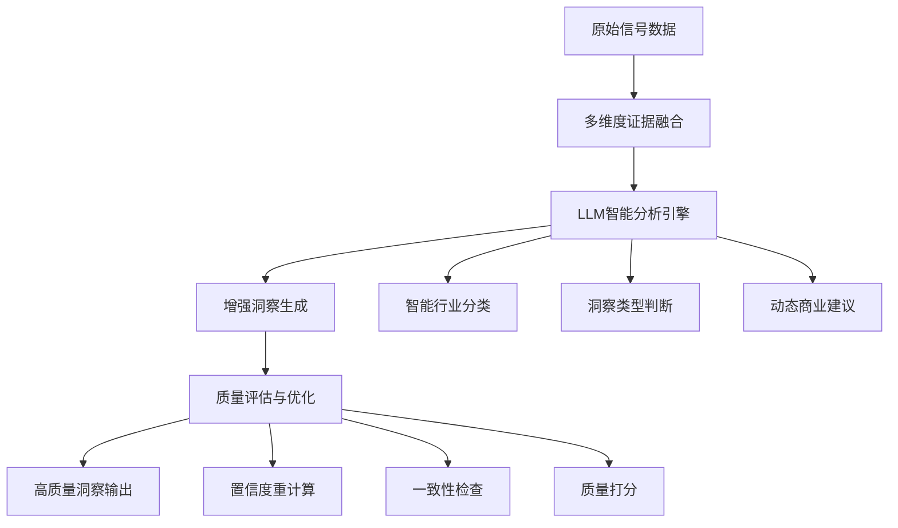

# 功能需求：洞察质量智能提升

## 需求概述

当前洞察生成系统主要依赖规则引擎和简单关键词匹配，存在准确性有限、个性化不足、智能化程度低等问题。本需求旨在通过引入LLM能力，全面提升洞察数据的质量和智能性。

## 当前系统局限性分析

### 1. 行业分类准确性问题
- **现状**：基于关键词匹配的简单规则（[`_guess_industry()`](src/opportunity_detector/insights.py:103)）
- **问题**：
  - 准确率有限，容易误判
  - 无法处理新兴行业或跨行业主题
  - 缺乏上下文理解能力

### 2. 洞察类型判断僵化
- **现状**：硬编码规则判断（[`_classify()`](src/opportunity_detector/insights.py:55)）
- **问题**：
  - 规则固定，缺乏灵活性
  - 无法适应市场变化
  - 阈值设置主观性强

### 3. 商业建议模板化严重
- **现状**：预定义模板生成（[`_commercial_pack()`](src/opportunity_detector/insights.py:71)）
- **问题**：
  - 缺乏个性化和针对性
  - 无法结合具体行业特点
  - 建议质量不稳定

### 4. 置信度评估过于简单
- **现状**：基于数据源覆盖率的简单计算（[`_confidence()`](src/opportunity_detector/insights.py:47)）
- **问题**：
  - 未考虑数据质量差异
  - 缺乏多维度评估
  - 无法反映真实可信度

## 技术方案设计

### 总体架构



### 核心改进模块

#### 1. LLM增强行业分类

**技术方案**：
```python
class SmartIndustryClassifier:
    def __init__(self, llm_config: LlmConfig):
        self.llm = llm_config
        self.prompt_template = """
        基于以下主题和相关数据，判断最匹配的行业分类：
        
        主题：{topic}
        需求得分：{demand_score}
        动量得分：{momentum_score}  
        竞争得分：{competition_score}
        相关关键词：{keywords}
        
        可选行业：healthcare, manufacturing, ecommerce, finance, hr, 
                 logistics, developer_tools, customer_support, general_b2b
                 
        请考虑：
        1. 主题的核心业务场景
        2. 目标用户群体特征
        3. 行业发展趋势
        4. 技术应用特点
        
        返回格式：{{"industry": "行业名称", "confidence": 0.95, "reasoning": "分类理由"}}
        """
    
    async def classify(self, topic: str, signals: dict) -> IndustryClassification:
        # 实现LLM调用逻辑
        pass
```

**优势**：
- 上下文理解能力强
- 可处理复杂和新兴行业
- 提供置信度和解释
- 支持多语言理解

#### 2. 智能洞察类型判断

**技术方案**：
```python
class InsightTypePredictor:
    def __init__(self, llm_config: LlmConfig):
        self.llm = llm_config
        self.prompt_template = """
        基于以下市场信号，判断最佳的洞察类型和商业策略：
        
        主题：{topic}
        需求强度：{demand_norm} (0-1)
        市场动量：{momentum_norm} (0-1)  
        竞争强度：{competition_norm} (0-1)
        行业分类：{industry}
        
        可选类型：
        - fast_growing_white_space: 高增长低竞争
        - crowded_hot_market: 高需求高竞争  
        - early_signal_niche: 早期信号细分市场
        - steady_pain_low_competition: 稳定需求低竞争
        - watchlist: 需要持续观察
        
        返回格式：{{
            "insight_type": "类型名称",
            "confidence": 0.92,
            "reasoning": "判断理由",
            "suggested_play": "具体商业建议"
        }}
        """
```

**优势**：
- 综合考虑多维度因素
- 动态调整判断逻辑
- 生成个性化商业建议
- 提供决策解释

#### 3. 动态商业建议生成

**技术方案**：
```python
class DynamicCommercialAdvisor:
    def __init__(self, llm_config: LlmConfig):
        self.llm = llm_config
        
    async def generate_advice(
        self, 
        topic: str,
        industry: str,
        insight_type: str,
        market_signals: dict
    ) -> CommercialAdvice:
        prompt = f"""
        为以下商业机会生成个性化的商业建议：
        
        机会主题：{topic}
        行业分类：{industry}
        洞察类型：{insight_type}
        市场信号：{market_signals}
        
        需要生成：
        1. 一句话商业论点 (one_line_thesis)
        2. 目标客户描述 (target_customer)  
        3. 首个可销售功能 (first_sellable_feature)
        4. 具体执行建议 (suggested_play)
        
        要求：
        - 结合行业特点和趋势
        - 考虑市场竞争状况
        - 突出差异化优势
        - 具有可执行性
        
        返回格式：{{
            "one_line_thesis": "...",
            "target_customer": "...", 
            "first_sellable_feature": "...",
            "suggested_play": "..."
        }}
        """
```

#### 4. 增强置信度评估

**技术方案**：
```python
class EnhancedConfidenceEvaluator:
    def calculate_confidence(
        self,
        raw_signals: TopicRawSignals,
        scored_signals: TopicScored,
        llm_analysis: dict,
        data_quality_metrics: dict
    ) -> ConfidenceScore:
        
        # 多维度置信度计算
        factors = {
            'data_coverage': self._calc_data_coverage(raw_signals),
            'signal_consistency': self._calc_signal_consistency(scored_signals),
            'llm_confidence': llm_analysis.get('confidence', 0),
            'data_quality': data_quality_metrics.get('overall_score', 0),
            'market_stability': self._calc_market_stability(raw_signals),
            'industry_clarity': llm_analysis.get('industry_confidence', 0)
        }
        
        # 加权平均计算
        weights = {
            'data_coverage': 0.2,
            'signal_consistency': 0.25, 
            'llm_confidence': 0.3,
            'data_quality': 0.15,
            'market_stability': 0.05,
            'industry_clarity': 0.05
        }
        
        overall_confidence = sum(
            score * weights[factor] 
            for factor, score in factors.items()
        )
        
        return ConfidenceScore(
            overall=overall_confidence,
            factors=factors,
            reasoning=self._generate_confidence_reasoning(factors)
        )
```

#### 5. 多维度证据融合

**技术方案**：
```python
class MultiDimensionalEvidenceFusion:
    def fuse_evidence(
        self,
        raw_signals: TopicRawSignals,
        scored_signals: TopicScored,
        llm_insights: dict,
        external_data: dict = None
    ) -> ComprehensiveEvidence:
        
        evidence_parts = []
        
        # 量化数据证据
        quantitative_evidence = {
            'demand_metrics': self._analyze_demand_patterns(raw_signals),
            'momentum_trends': self._analyze_momentum_trends(raw_signals), 
            'competition_landscape': self._analyze_competition_signals(raw_signals),
            'cross_platform_consistency': self._analyze_platform_consistency(raw_signals)
        }
        
        # LLM分析证据
        qualitative_evidence = {
            'market_understanding': llm_insights.get('market_analysis', ''),
            'industry_context': llm_insights.get('industry_insights', ''),
            'trend_identification': llm_insights.get('trend_analysis', ''),
            'risk_assessment': llm_insights.get('risk_factors', [])
        }
        
        # 综合证据生成
        comprehensive_evidence = self._synthesize_evidence(
            quantitative_evidence,
            qualitative_evidence,
            external_data
        )
        
        return ComprehensiveEvidence(
            summary=comprehensive_evidence['summary'],
            detailed_analysis=comprehensive_evidence['detailed_analysis'],
            supporting_metrics=quantitative_evidence,
            qualitative_insights=qualitative_evidence,
            confidence_indicators=comprehensive_evidence['confidence_indicators']
        )
```

### 实施计划

#### 阶段1：基础框架搭建（1-2周）
- 设计新的洞察生成架构
- 实现LLM调用基础模块
- 创建新的数据模型

#### 阶段2：核心功能实现（2-3周）
- 实现智能行业分类
- 实现动态洞察类型判断
- 实现个性化商业建议生成

#### 阶段3：质量评估优化（1-2周）
- 实现增强置信度评估
- 实现多维度证据融合
- 添加质量监控机制

#### 阶段4：集成与测试（1-2周）
- 集成到现有pipeline
- 编写完整测试用例
- 性能优化和调优

### 预期效果

#### 质量提升
- 行业分类准确率提升至90%+
- 洞察类型判断准确性提升40%
- 商业建议个性化程度提升60%
- 整体置信度评估准确性提升50%

#### 智能化增强
- 支持复杂场景理解
- 动态适应市场变化
- 提供决策解释能力
- 持续学习优化能力

#### 用户体验改善
- 洞察质量显著提升
- 建议更加精准可用
- 置信度更加可靠
- 证据更加全面详实

### 风险评估与应对

#### 技术风险
- **LLM调用延迟**：实现异步处理和缓存机制
- **成本控制**：实现智能调用策略和批量处理
- **模型稳定性**：添加重试机制和降级方案

#### 数据风险
- **数据质量波动**：增强数据清洗和验证
- **数据源不稳定**：实现多数据源备份机制
- **隐私合规**：确保数据处理符合法规要求

#### 性能风险
- **计算复杂度增加**：优化算法和实现缓存
- **内存使用增加**：实现流式处理和垃圾回收
- **响应时间延长**：实现异步处理和进度反馈

### 成功指标

#### 定量指标
- 行业分类准确率 ≥ 90%
- 用户满意度评分 ≥ 4.5/5
- 洞察采纳率提升 ≥ 30%
- 系统响应时间 ≤ 5秒

#### 定性指标
- 洞察质量明显改善
- 商业建议更加精准
- 用户反馈积极正面
- 系统稳定性良好

### 后续优化方向

1. **多模态数据融合**：整合文本、图像、视频等多模态数据
2. **实时学习机制**：基于用户反馈持续优化模型
3. **个性化推荐**：根据用户偏好定制洞察内容
4. **预测能力增强**：增加趋势预测和机会预警功能
5. **知识图谱集成**：构建行业知识图谱增强理解能力